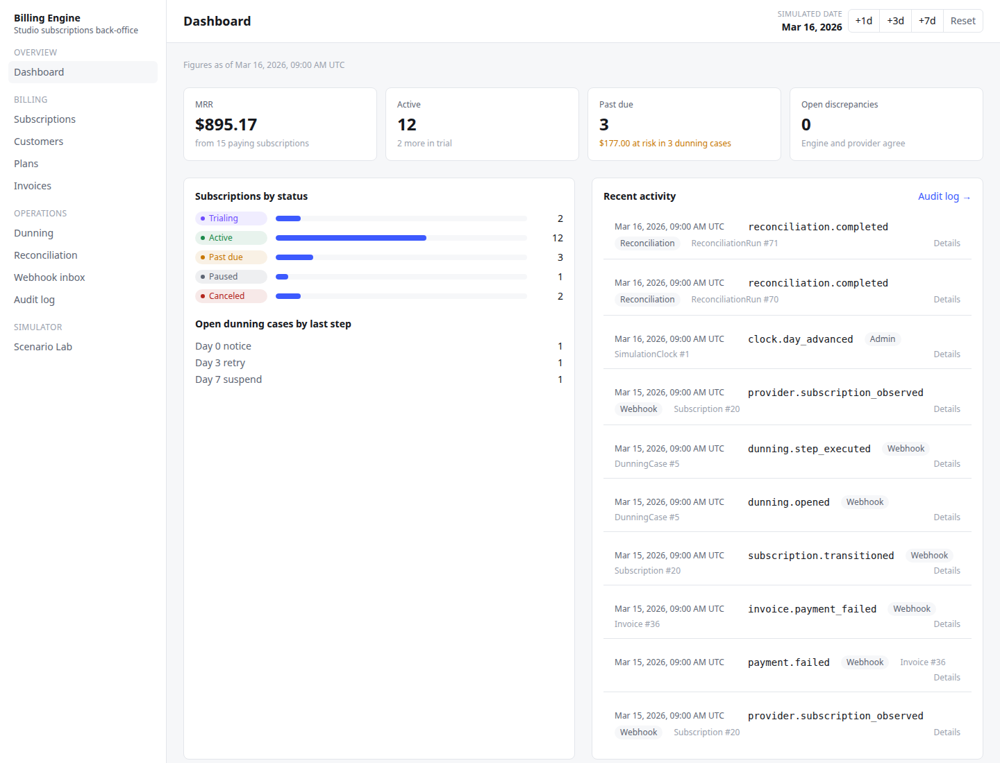
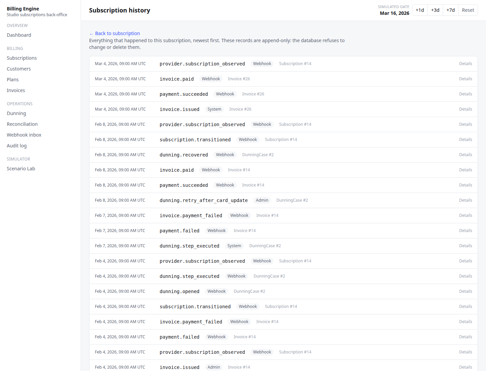
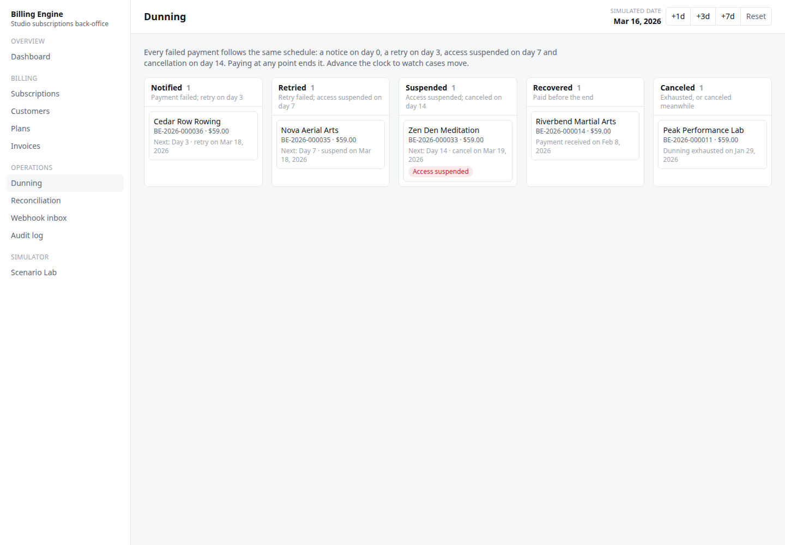
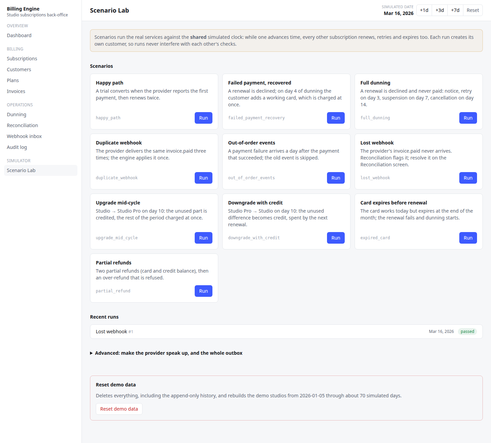
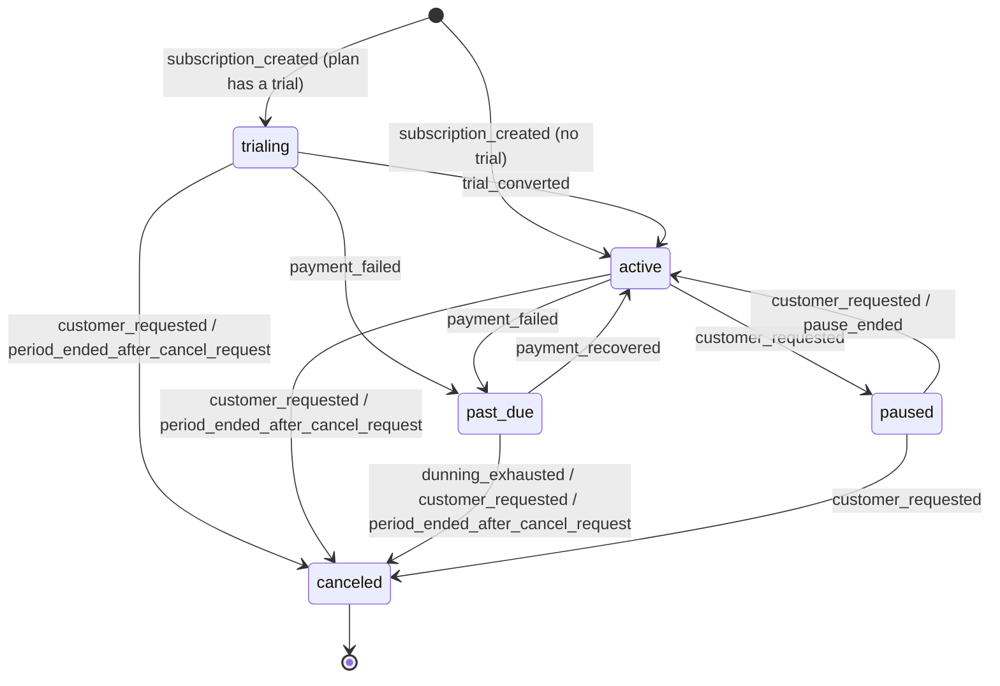
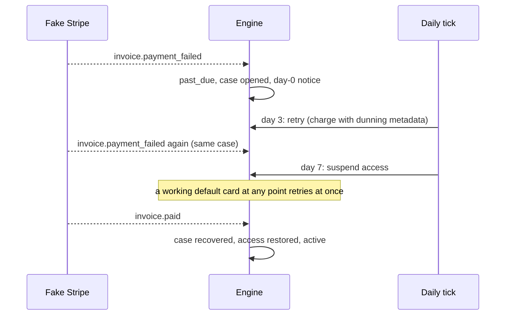
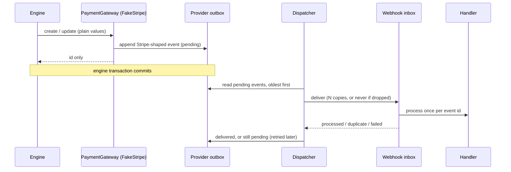

# Billing Engine

A subscription billing engine for a fictional SaaS that sells subscriptions to gyms and
fitness studios. It is a portfolio project focused on one narrow, easy-to-get-wrong problem:
**managing the financial lifecycle of a subscription correctly**.

The payment provider (Stripe) is simulated in-process and a simulated clock fast-forwards
weeks of billing in seconds, so every hard case can be reproduced with one click.

**What to look at**

- A strict [subscription state machine](#subscription-lifecycle) with a single write path.
- [Idempotent webhook processing](#webhook-processing): an inbox deduplicated by event id,
  stale events skipped, failures retried by the provider.
- [Proration](#proration) to the cent, with a signed quote so the amount confirmed is the
  amount previewed.
- A [dunning schedule](#dunning) (day 0, 3, 7, 14) that runs exactly once per step.
- [Reconciliation](#reconciliation) against the provider's own history, with evidence and
  resolutions that never patch data directly.
- An append-only audit trail enforced by the database, and a history screen per subscription.
- A [Scenario Lab](#try-it) that replays ten edge cases, each ending in checks that also run
  in the test suite.



| Subscription history | Dunning board | Scenario Lab |
|---|---|---|
|  |  |  |

## Stack

| Part | Technology |
|---|---|
| API | Ruby 3.4, Rails 8.1 (API-only), SQLite, RSpec |
| Web | Vue 3 (Composition API), TypeScript, Pinia, Vue Router, Tailwind CSS v4, Vitest |
| CI | GitHub Actions (lint, security scans, tests, build) |

## Quick start

### Requirements

- Ruby 3.4.11 (see `api/.ruby-version`)
- `sqlite3` command-line tool (Rails uses it to load `db/structure.sql`)
- Node.js 22.18+ or 24.12+
- pnpm 10

### Setup and run

```sh
bin/setup   # installs gems and packages, prepares the SQLite database
bin/dev     # starts the API and the web app together
```

| App | URL |
|---|---|
| Web | http://localhost:3000 |
| API | http://localhost:3001/api/v1 |

The first `bin/setup` creates the database and seeds the demo (see [Demo data](#demo-data)).

### Environment variables

All optional; the defaults work for local development.

| Variable | App | Default | Purpose |
|---|---|---|---|
| `VITE_API_URL` | web | `http://localhost:3001/api/v1` | API base URL |
| `WEB_ORIGIN` | api | `http://localhost:3000` | Origin allowed by CORS |
| `SIMULATOR_ENABLED` | api | `true` in development/test | Mounts the simulator endpoints (clock, fake provider) |
| `PORT` | api | `3001` | API port |

### Tests and checks

```sh
cd api && bundle exec rspec && bin/rubocop && bin/brakeman   # includes all 10 scenarios
cd web && pnpm lint && pnpm type-check && pnpm test:unit --run
```

CI (GitHub Actions) runs the same checks plus `bundler-audit` and a production build.

## Try it

Open the **Scenario Lab** (`/simulator`). Each card runs a short story against the real
services and ends with checks; the result shows every step with its simulated date, links to
what it created and the provider events it caused. Four worth running first:

1. **Duplicate webhook** (`duplicate_webhook`): `invoice.paid` is sent three more times. Open
   the webhook inbox from the events list: one row, three duplicate deliveries, and the
   subscription history has a single payment.
2. **Lost webhook** (`lost_webhook`): the provider loses the renewal's `invoice.paid`. Follow
   the *Reconciliation* link: the missing event, the unpaid invoice and the status are
   flagged. Redeliver it from there and run reconciliation again: zero discrepancies.
3. **Full dunning** (`full_dunning`): a declined renewal walks through day 0, 3, 7 and 14.
   The history shows each step, the suspension and the final cancellation; the invoice ends
   uncollectible.
4. **Upgrade mid-cycle** (`upgrade_mid_cycle`): the proration invoice carries a credit line
   for the unused days of the old plan and a charge for the new one, to the cent.

Scenarios move the **shared** simulated clock, so other subscriptions renew while they run.
Each run creates its own customer, so runs never break each other's checks.

### Demo data

The seeds build about 20 fictional studios by replaying 70 simulated days from
2026-01-05, only through the services and the clock (never by inserting rows), so the audit
trail, the provider's outbox and the invoices agree from the first screen. They end with
every state on display: trials, active subscriptions on every plan (one yearly), an upgrade
and a downgrade, refunds to the card and to the credit balance, a paused subscription, two
cancellations, one scheduled cancellation, dunning cases at day 0, 3 and 7, one recovered
and one exhausted, and a renewal that failed on an expired card. Reconciliation starts at
zero discrepancies.

**Reset demo data** (bottom of the Scenario Lab, or `POST /api/v1/simulator/reset` with
`{"confirm": "reset"}`) deletes everything, including the append-only history, and runs the
seeds again. It is the only path in the app that removes history.

## Dashboard and MRR

The home screen summarizes billing health as of the simulated date and refreshes whenever
time moves (clock, scenario or reset). Every tile links to the list behind it.

**MRR** (monthly recurring revenue), since definitions vary:

- Counts `active` and `past_due` subscriptions, at the price of the plan each is on now.
  `past_due` revenue is at risk, not lost yet; a subscription set to cancel at period end
  still pays until then.
- Leaves out `trialing` (not paying yet), `paused` (not billed) and `canceled`.
- A yearly plan counts as its price ÷ 12, rounded to the cent **per subscription** ($590/yr
  → $49.17), so MRR is always the sum of what each subscription contributes.
- A scheduled plan change counts once it is applied. Credit and refunds don't reduce MRR:
  it measures what is contracted, not what was collected.

**Amount at risk**: what the subscriptions in dunning still owe, over all their open
invoices.

## Subscription lifecycle



The diagram mirrors `SubscriptionStateMachine::TRANSITIONS`, the single
source of truth; a spec walks every (from, to) pair of that table, so an edge can't be added
or removed without the tests noticing. Status changes go through one service,
`Subscriptions::Transition`, which checks the edge and the reason, then updates the status,
writes a `subscription_state_transitions` row and an audit event in the same transaction.
Updating `status` any other way raises.

A cancellation "at period end" is a flag, not a state: the subscription keeps its status
until the period ends, and the flag can be removed until then.

## The money cycle

```mermaid
sequenceDiagram
    participant Tick as Daily tick
    participant Engine
    participant Provider as Fake Stripe
    participant Inbox as Webhook inbox
    Tick->>Engine: trial ended / period ended
    Engine->>Engine: roll period, issue invoice (credit applied first), open
    Engine->>Provider: pay_invoice (default card)
    Provider-->>Inbox: charge.succeeded + invoice.paid
    Inbox->>Engine: invoice paid; trialing → active, past_due → active
    Provider-->>Inbox: or charge.failed + invoice.payment_failed
    Inbox->>Engine: attempt recorded; trialing/active → past_due
```

- A subscription created without a trial is billed at creation; a trial is billed when it
  ends; active subscriptions are billed when their period ends. `past_due` and `paused`
  subscriptions are not renewed.
- Credit balance is spent before the card. A card's result comes from its test token and its
  expiry date against the simulated clock.
- An open invoice can be retried from its screen with the customer's current default card.

## Proration

Changing plans mid-period credits the unused part of the old plan and charges the new plan
for the time left:

```
ratio  = time left in the period / length of the period      (exact Rational)
credit = -(old price × ratio)   rounded half up to the cent
charge =   new price × ratio    rounded half up to the cent
net    = credit + charge
```

Worked example (numbers from the calculator's spec): a $49/month subscription whose period is
Oct 1 – Nov 1 (31 days) upgrades to $99/month on Oct 11, with 21 days left:

| Line | Amount |
|---|---|
| Unused time on Basic: −$49.00 × 21/31 | −$33.19 |
| Remaining time on Pro: $99.00 × 21/31 | +$67.06 |
| **Charged now** | **$33.87** |

- **Upgrades** are billed immediately through a proration invoice for the rest of the period;
  the billing anchor doesn't move. If that payment fails, the new plan stays and the
  subscription goes `past_due`, like any unpaid invoice (Stripe's default).
- **Downgrades** turn the unused difference into credit (or wait for the renewal, if the
  operator prefers); the next invoice spends it before charging the card.
- **What is charged is what was previewed.** Preview and apply run the same quote, and apply
  must send back the preview's `quote_token`, a signed copy of the proration date the server
  used (a client can't backdate it to grant itself more credit). If the period renewed in
  between, the API
  answers 409 instead of charging a different amount.
- Each line is rounded on its own, so invoice lines always add up exactly to the net shown.

## Dunning

When a payment fails, the subscription goes `past_due` and a dunning case opens:

| Day | Step | What happens |
|---|---|---|
| 0 | notice | the customer is told the payment failed |
| 3 | retry | the card is charged again |
| 7 | suspend | access is suspended (the subscription stays `past_due`) |
| 14 | cancel | the subscription is canceled, the invoice becomes uncollectible |



Each step runs once, on its day (days are simulated, one tick per day). A payment at any
point ends the case and the remaining steps never run. What the customer would have been
emailed is kept in an outbox (`customer_notifications`).

## Reconciliation

The fake provider keeps its own history of everything it did and reported (its outbox), and
never reads the engine's tables. Reconciliation replays that history per subscription and
compares the result with what the engine believes:

- **Subscription**: the provider's last snapshot, with Stripe's payment rule on top (a paid
  invoice makes a `past_due` subscription active; a failed payment makes an active one
  `past_due`). Status, plan and current period are compared.
- **Invoices**: paid or not, amount paid, amount refunded to the card.
- **Events**: sent but never received (a lost webhook), or received but failed.

Each difference is recorded with the provider events that prove it, once (a later run updates
it, or marks it `cleared` if it stopped being true). Nothing is fixed automatically; the
operator picks a resolution, and none of them patch data directly:

| Discrepancy | Resolutions |
|---|---|
| Lost event | redeliver it through the normal inbox, so every side effect runs |
| Failed event | reprocess it |
| Status differs | apply the provider's value through the state machine (refused if there is no such transition), or resend the engine's state to the provider |
| Plan / period differ | resend the engine's state to the provider |
| Any | acknowledge, with a note |

A full check runs at the end of every simulated day, after that day's changes have reached the
provider, and on demand from the Reconciliation screen.

## Refunds

A paid invoice can be refunded in full or in parts, up to what the card actually paid:

- **To the card**: the engine records a `pending` refund and asks the provider; the
  provider's `refund.updated` settles it as `succeeded` or `failed` (a failed refund gives its
  amount back to what can still be refunded).
- **To the credit balance**: no money leaves, so it is immediate and internal: a ledger credit
  that the next invoices spend.

The refundable amount counts pending refunds, so two quick requests can't both pass, and the
limit is also a database check and a rule of the provider itself. Refunds never change the
subscription; canceling is a separate action.

## Webhook processing

Provider events arrive at `POST /api/v1/webhooks/stripe` and go through an inbox
(`webhook_events`), one row per provider event id:

1. **Claim.** `INSERT … ON CONFLICT (provider_event_id) DO NOTHING` guarantees one row per
   event, however many deliveries race.
2. **Process.** A second transaction locks and re-reads the row. If it is already done, the
   delivery is a duplicate: it is counted and answered 200. Otherwise the handler runs and
   its changes commit together with the row's final status, so an event can't be half
   applied, or applied twice.
3. **Fail loudly.** If the handler raises, its changes roll back and a third transaction
   records the failure on the row; the endpoint answers 500, which is what makes the
   provider retry. A failed row can also be reprocessed from the inbox screen.

Every change a webhook causes is audited with actor `webhook` and a link to the inbox row,
so the audit log can always answer "which event did this?".

### The fake provider

The payment provider is a fake Stripe living in the same app (`app/models/fake_stripe/`).
The engine only reaches it through `PaymentGateway`, and it only answers the way Stripe does:
identifiers now, outcomes later as webhooks.



The Scenario Lab (`/simulator`, under *Advanced*) shows the outbox and can make the provider
report a subscription, possibly disagreeing with the engine, dropped (a lost webhook) or sent
several times (duplicates).

Try it with the fixture (`invoice.finalized`, which the engine doesn't act on because it
issued the invoice itself, so it is acknowledged and ignored):

```sh
curl -s -X POST localhost:3001/api/v1/webhooks/stripe \
  -H 'Content-Type: application/json' -d @api/spec/fixtures/webhooks/invoice_finalized.json
# {"status":"ignored_unhandled",...}  — send it again:
# {"status":"duplicate",...}          — the inbox shows one row with 1 duplicate delivery
```

## Architecture decisions

Diagrams of the components, the main flows and the data model are in
[`docs/architecture.md`](docs/architecture.md). Every decision below was taken in one of the
[plans](docs/) and is recorded there with its reasoning.

### Time and consistency

- **Simulated clock.** Billing flows span weeks (trials, renewals, a 14-day dunning
  schedule), so every piece of code reads time from `BillingClock.now`, never from
  `Time.current`. A custom RuboCop cop (`Billing/DirectTimeAccess`) fails the build if real
  time is read anywhere else. Advancing the clock runs one tick per simulated day, so work due
  on day 3 happens on day 3 even when you jump a week. Time only moves forward, except for an
  explicit reset.
- **Append-only audit trail, enforced by the database.** Every state change writes a row
  to `billing_events` through a single entry point (`Audit.record`), inside the same
  transaction as the change itself, so both commit or neither does. Rows can't be changed
  afterwards: the model refuses updates and deletes, and SQLite triggers refuse them too, so
  paths that skip the model (`update_all`, `delete_all`, raw SQL) fail as well. Each event
  stores both business time (`occurred_at`, from the simulated clock) and the real time it
  was written.
- **`structure.sql` instead of `schema.rb`.** `schema.rb` can't represent triggers, so a test
  or freshly created database would silently lose the append-only guarantee. The cost is
  needing the `sqlite3` CLI.
- **Optimistic locking on every operator action.** Each action carries the `lock_version` the
  screen was loaded with. If the subscription changed in between (another operator, or a tick
  that renewed or canceled it), the API answers 409 and applies nothing; the UI offers to
  reload instead of acting on a state nobody saw.
- **Idempotency keys for state-changing requests.** The frontend sends one
  `Idempotency-Key` per user intent (per dialog). The API stores the first response and
  replays it for retries of the same request (errors included), refuses the key for a
  different request, and doesn't keep 5xx responses so a real retry can run.

### Money

- **Money as integer cents.** Every amount is stored as `*_cents` integers with a `currency`
  column (always `USD`). Floats never touch money.
- **Credit is a ledger, the balance is a cache.** Customer credit only moves through
  `CreditLedger`, which writes an append-only entry, updates the cached balance and audits
  the movement in one transaction, with the customer row locked so two debits can't both
  pass the balance check. Each reason can only move the balance in its own direction.
- **Plans are immutable where it matters.** A plan's code, price, currency and interval are
  read-only once created (assigning them raises). Changing the price of a plan in use would
  silently change what current subscribers pay; repricing means creating a new plan and
  archiving the old one.
- **An issued invoice is a document.** Number, period and amounts are read-only, lines are
  append-only, and `total = subtotal - credit applied` is a database check. Numbers are
  gap-free per year: the counter is incremented in the invoice's own transaction.
- **Invoices are only settled by the provider's webhook.** The engine issues an invoice,
  asks the provider to collect it and waits; `invoice.paid` is the only thing that marks it
  paid and activates a trial or recovers a past-due subscription. Even a $0 invoice covered
  by credit goes through the provider, so there is exactly one settlement path.
- **Pausing stops the billing clock.** Paused time is never billed: on resume, a period that
  ended during the pause is replaced by a new one starting at the resume moment.

### Provider and webhooks

- **One gateway, outcomes only via webhooks.** The engine talks to the provider through
  `PaymentGateway`; replacing the fake with real Stripe means one new module. Gateway calls
  return identifiers only, so no engine code can depend on a synchronous "it worked".
- **The fake provider is an event-sourced outbox that never reads engine data.** Its
  methods take plain values and write only to `mocked_webhook_events` (a spec checks every SQL
  statement). That independence is what makes its history a fair "expected state" for
  reconciliation.
- **Delivery after commit.** Events are delivered once every open transaction has
  committed, so a webhook never sees, or acts on, data that may still roll back, and the
  provider never hears about a change that rolled back.
- **Subscription changes are pushed from an `after_commit` callback**, with a snapshot of
  plain values. No service can forget it, and webhook observation writes with
  `update_columns`, so provider reports are never echoed back.
- **Test cards by token, like Stripe test mode.** A payment method stores a token such as
  `pm_card_chargeDeclinedInsufficientFunds`, and that token decides how the fake provider
  answers a charge. Demo scenarios pick a card that will fail without any real card data.
- **Inbox pattern for webhooks, deduplicated by event id.** The provider's event id is the
  idempotency key, backed by a unique index. Duplicates and deliberately ignored event types
  get 200 (anything else makes the provider retry forever); a failed handler gets 500 so the
  provider does retry.
- **The engine is the authority on subscription state.** `customer.subscription.*` events are
  recorded ("the provider says past_due, we say active"), not applied. Disagreements are for
  reconciliation to surface, instead of the provider silently overwriting engine decisions.
- **Ordering per object.** Each record remembers the newest provider event applied to it and
  skips older ones. The check is per record: an old event about one invoice is still valid
  after a newer event about another.

### API and frontend

- **Allowed actions come from the API.** `allowed_actions` is computed by the model from the
  state and flags; the API refuses anything else and the UI only renders those buttons, so
  both can't disagree.
- **One error shape, one list shape.** Every API error is
  `{ "error": { "code", "message", "details" } }`, with 422 for business-rule violations, 409
  for concurrent-edit conflicts and 404 for missing records. Every list is
  `{ "data": [...], "meta": { "page", "per_page", "total_count", "total_pages" } }`.
- **No authentication.** The app models a single back-office operator. Authentication is out
  of scope for a project about billing correctness.
- **Lean Rails.** Only the frameworks in use are loaded (Active Record, Active Job, Action
  Controller). Deployment tooling was removed, since the project is meant to run locally.

## Edge cases handled

Each case links to the spec that proves it; where a Scenario Lab scenario reproduces it, its
key is given in brackets.

### Time and audit

- The simulated clock can't move backwards (except through an explicit reset), and advancing
  several days runs each day's work in order ([billing_clock_spec.rb](api/spec/services/billing_clock_spec.rb)).
- A tick that fails rolls back that simulated day instead of leaving time advanced with
  half-done work ([billing_clock_spec.rb](api/spec/services/billing_clock_spec.rb)).
- Updating or deleting an audit row is refused by the database, even through raw SQL
  ([billing_event_spec.rb](api/spec/models/billing_event_spec.rb)).
- A business change and its audit row can't be split: recording an audit event outside a
  transaction raises, and rolling back the change rolls back the event
  ([audit_spec.rb](api/spec/services/audit_spec.rb)).
- Resetting the demo is the only way history is deleted: the append-only triggers are
  dropped and recreated inside the same transaction, and the request must say `confirm:
  "reset"` ([reset_spec.rb](api/spec/services/demo/reset_spec.rb), [scenarios_spec.rb](api/spec/requests/api/v1/simulator/scenarios_spec.rb)).

### Catalog, customers and operator actions

- Repricing a plan can't affect current subscribers: price and interval can't be changed
  after creation (model and database rules), and archived plans keep working for existing
  subscribers ([plan_spec.rb](api/spec/models/plan_spec.rb), [archive_spec.rb](api/spec/services/plans/archive_spec.rb)).
- A card that has already expired is refused on attach. A card can also expire while a
  subscription runs, because expiry is checked against the simulated clock
  ([attach_spec.rb](api/spec/services/payment_methods/attach_spec.rb)).
- Customer credit can never go negative (service check, model validation and a database
  constraint), and a failed operation leaves the ledger and the cached balance untouched
  ([credit_ledger_spec.rb](api/spec/services/credit_ledger_spec.rb), [credit_ledger_entry_spec.rb](api/spec/models/credit_ledger_entry_spec.rb)).
- At most one default card per customer, enforced by a partial unique index; switching the
  default unsets the old one first in the same transaction
  ([make_default_spec.rb](api/spec/services/payment_methods/make_default_spec.rb)).
- Emails are unique regardless of case or surrounding spaces ([customer_spec.rb](api/spec/models/customer_spec.rb)).
- Two operators acting on the same subscription: the second one gets a 409 instead of
  overwriting the first ([transition_spec.rb](api/spec/services/subscriptions/transition_spec.rb), [subscriptions_spec.rb](api/spec/requests/api/v1/subscriptions_spec.rb)).
- Double click or retry on "Cancel": the idempotency key makes it apply once and replays the
  same response. After a 4xx the frontend starts a new key, so fixing the input and submitting
  again is a new attempt, not a "reused key" error; after a network error it keeps the key
  ([subscriptions_spec.rb](api/spec/requests/api/v1/subscriptions_spec.rb), [idempotency.spec.ts](web/src/api/__tests__/idempotency.spec.ts)).
- Money typed by the operator is parsed digit by digit, never through floating point, and an
  ambiguous comma (`12,5`) is rejected instead of guessed ([money.spec.ts](web/src/utils/__tests__/money.spec.ts)).

### Subscription lifecycle

- An invalid status change is refused with the allowed alternatives, and nothing is written
  ([subscription_state_machine_spec.rb](api/spec/models/subscription_state_machine_spec.rb), [transition_spec.rb](api/spec/services/subscriptions/transition_spec.rb)).
- Cancel at period end, including during a trial: the trial ends canceled instead of
  converting, because cancellations run before trial conversion in each tick
  ([subscription_ticks_spec.rb](api/spec/services/ticks/subscription_ticks_spec.rb)).
- Pause with an automatic resume date; an open-ended pause stays paused until resumed
  ([subscription_ticks_spec.rb](api/spec/services/ticks/subscription_ticks_spec.rb), [admin_actions_spec.rb](api/spec/services/subscriptions/admin_actions_spec.rb)).
- One live subscription per customer, enforced by a partial unique index as well as by the
  service ([create_spec.rb](api/spec/services/subscriptions/create_spec.rb)).

### Webhooks and the provider

- The same webhook delivered several times is applied once and counted as duplicates
  [`duplicate_webhook`] ([ingest_spec.rb](api/spec/services/webhooks/ingest_spec.rb)).
- Two deliveries of the same event racing each other: the lock and re-read inside the
  processing transaction let only one apply it ([ingest_spec.rb](api/spec/services/webhooks/ingest_spec.rb)).
- A webhook handler that fails leaves no partial changes, keeps its error on the inbox row,
  answers 500 so the provider retries, and succeeds on the next delivery
  ([ingest_spec.rb](api/spec/services/webhooks/ingest_spec.rb)).
- An event older than one already applied to the same record is skipped as stale; events
  sharing a timestamp are all processed [`out_of_order_events`] ([ingest_spec.rb](api/spec/services/webhooks/ingest_spec.rb)).
- Unknown event types are acknowledged and ignored; an event about a subscription the engine
  doesn't know fails (and is retried) instead of being dropped; a malformed payload (bad
  JSON, missing fields, `data.object` that isn't an object) gets 400, never a 500 that the
  provider would retry forever ([ingest_spec.rb](api/spec/services/webhooks/ingest_spec.rb), [webhooks_spec.rb](api/spec/requests/api/v1/webhooks_spec.rb)).
- Unsigned events are only accepted while the simulator is on; with it off, the endpoint
  refuses everything until real signature verification exists (fail closed)
  ([ingest_spec.rb](api/spec/services/webhooks/ingest_spec.rb)).
- A dropped (lost) webhook stays in the provider's outbox and never reaches the engine
  until it is delivered by hand; reconciliation flags it on its own [`lost_webhook`]
  ([dispatcher_spec.rb](api/spec/models/fake_stripe/dispatcher_spec.rb)).
- A delivery the inbox fails (500) stays pending at the provider and is retried on the next
  flush, at the latest once per simulated day; once it succeeds, the inbox processes it once
  ([dispatcher_spec.rb](api/spec/models/fake_stripe/dispatcher_spec.rb)).
- A change that rolls back never reaches the provider; a request refused by local checks
  (expired card, duplicate email) never reaches it either
  ([payment_gateway_integration_spec.rb](api/spec/services/payment_gateway_integration_spec.rb)).
- If the provider can't be told about a committed change, the change stands, the request
  still succeeds and the failure is audited (`provider.sync_failed`) for reconciliation, instead
  of a 500 for work that is already done ([payment_gateway_integration_spec.rb](api/spec/services/payment_gateway_integration_spec.rb)).
- An unexpected error while delivering a webhook counts as a failed delivery (retried later),
  never as an error for the request whose commit triggered the delivery. A manually delivered
  "lost" event that fails goes back to the retry queue
  ([dispatcher_spec.rb](api/spec/models/fake_stripe/dispatcher_spec.rb), [events_spec.rb](api/spec/requests/api/v1/simulator/events_spec.rb)).
- Recording a webhook doesn't bump the subscription's `lock_version`, so an operator's open
  screen isn't invalidated by an event that changed nothing
  ([payment_gateway_integration_spec.rb](api/spec/services/payment_gateway_integration_spec.rb)).

### Invoices and payments

- A trial becomes active only when `invoice.paid` arrives; a declined card, an expired card
  (checked against the simulated date) or no card at all moves it to `past_due` instead
  ([billing_cycle_spec.rb](api/spec/services/billing_cycle_spec.rb)).
- A card that expires between two renewals fails the second renewal with `expired_card`
  [`expired_card`] ([billing_cycle_spec.rb](api/spec/services/billing_cycle_spec.rb)).
- Credit covering part of an invoice reduces the charge; credit covering all of it settles
  the invoice without any charge. Ledger, invoice lines and totals always agree
  ([billing_cycle_spec.rb](api/spec/services/billing_cycle_spec.rb), [issue_spec.rb](api/spec/services/invoices/issue_spec.rb)).
- The same charge reported by two events (`charge.succeeded` and `invoice.paid`) is recorded
  once; a failure reported after the payment can't undo it [`out_of_order_events`]
  ([billing_cycle_spec.rb](api/spec/services/billing_cycle_spec.rb)).
- A trial is invoiced once, even if its payment keeps failing; a paused subscription is not
  billed for the paused time ([billing_cycle_spec.rb](api/spec/services/billing_cycle_spec.rb)).
- An invoice number rolled back with its invoice is reused, so the sequence has no gaps
  ([invoice_number_spec.rb](api/spec/models/invoice_number_spec.rb)).
- Only open invoices are ever sent for collection: the payment request itself refuses a
  paid or uncollectible invoice, whichever path asks. A canceled subscription is no longer
  shown as "suspended, pay to restore" ([dunning_spec.rb](api/spec/services/dunning_spec.rb), [invoices_spec.rb](api/spec/requests/api/v1/invoices_spec.rb)).

### Plan changes and proration

- A downgrade's unused difference becomes credit that the next renewal consumes; an upgrade
  whose payment fails keeps the new plan and moves the subscription to `past_due`
  [`downgrade_with_credit`, `upgrade_mid_cycle`] ([apply_spec.rb](api/spec/services/plan_changes/apply_spec.rb)).
- Two plan changes in the same period: each one prorates from the plan in effect at that
  moment ([apply_spec.rb](api/spec/services/plan_changes/apply_spec.rb)).
- The clock moving between preview and confirm doesn't change the amount (the preview's
  date is reused); a renewal in between makes the preview stale (409). The date comes back
  as a signed token, so it can't be backdated to inflate a credit or a charge
  ([apply_spec.rb](api/spec/services/plan_changes/apply_spec.rb), [plan_changes_spec.rb](api/spec/requests/api/v1/plan_changes_spec.rb)).
- A plan change during a trial swaps the plan without moving money; the trial-end invoice is
  at the new price ([apply_spec.rb](api/spec/services/plan_changes/apply_spec.rb)).
- A change scheduled for the end of the period is applied by the renewal, which bills the new
  price; scheduling another replaces it, and canceling the subscription drops it
  ([apply_spec.rb](api/spec/services/plan_changes/apply_spec.rb), [billing_cycle_spec.rb](api/spec/services/billing_cycle_spec.rb)).
- Changing between monthly and yearly billing is refused (not supported) instead of being
  prorated wrongly ([apply_spec.rb](api/spec/services/plan_changes/apply_spec.rb)).

### Refunds

- Partial refunds add up to exactly what was paid and not one cent more (service, database
  and provider all refuse the extra cent); pending refunds count against the limit
  [`partial_refund`] ([create_spec.rb](api/spec/services/refunds/create_spec.rb)).
- A refund that fails at the provider releases its amount; a refund to the credit balance
  is immediate and spent by the next invoice ([create_spec.rb](api/spec/services/refunds/create_spec.rb)).
- A refund's webhooks delivered twice don't count it twice; an invoice paid entirely with
  credit has nothing refundable ([create_spec.rb](api/spec/services/refunds/create_spec.rb)).

### Dunning

- Dunning steps run exactly on days 0, 3, 7 and 14, whether the clock moves day by day or
  two weeks at once; a job running twice doesn't repeat a step or a notification
  [`full_dunning`] ([dunning_spec.rb](api/spec/services/dunning_spec.rb)).
- A retry that fails again continues the same case; a working default card added during
  dunning retries at once, and paying after the suspension restores access
  [`failed_payment_recovery`] ([dunning_spec.rb](api/spec/services/dunning_spec.rb)).
- Canceling during dunning closes the case but keeps the invoice owed; a case that runs out
  marks the invoice uncollectible, so it can't be retried or refunded afterwards
  ([dunning_spec.rb](api/spec/services/dunning_spec.rb)).

### Reconciliation

- A lost `invoice.paid` shows up as the missing event, the unpaid invoice and the wrong
  subscription status, with the event as evidence; redelivering it fixes all three
  [`lost_webhook`] ([run_spec.rb](api/spec/services/reconciliation/run_spec.rb)).
- A correction the state machine doesn't allow (the provider says `active`, the engine
  already `canceled`) is refused; the operator can only acknowledge it, with a note
  ([run_spec.rb](api/spec/services/reconciliation/run_spec.rb), [reconciliation_spec.rb](api/spec/requests/api/v1/reconciliation_spec.rb)).
- A change the provider was never told about (its sync failed) is caught and resent
  ([run_spec.rb](api/spec/services/reconciliation/run_spec.rb)).
- Reconciliation never reports differences that are only "in flight" (a change committed
  but not yet delivered), and the same difference found twice is recorded once; an
  acknowledged difference isn't reported again unless its values change
  ([run_spec.rb](api/spec/services/reconciliation/run_spec.rb)).
- Correcting a status directly is blocked while the lost event behind it can still be
  redelivered; if a subscription leaves `past_due` without a payment anyway, its dunning case
  closes instead of failing on day 14. A reconciliation error never stops the simulated clock
  ([run_spec.rb](api/spec/services/reconciliation/run_spec.rb), [dunning_spec.rb](api/spec/services/dunning_spec.rb)).
- Seeds and scenarios go through the same services as the operator, so the demo can't show
  a state the engine couldn't reach; every scenario also runs in the test suite, and the
  seeded demo reconciles to zero differences
  ([catalog_spec.rb](api/spec/services/scenarios/catalog_spec.rb), [seed_spec.rb](api/spec/services/demo/seed_spec.rb)).

## Out of scope and future improvements

Deliberately left out; each is a clean extension point rather than a rewrite:

- Real Stripe integration and webhook signature verification (the gateway and the verifier
  are single swap points).
- Disputes and chargebacks.
- Proration when switching between monthly and yearly billing (refused today).
- A hash chain on the audit log, so tampering outside the application is detectable.
- History charts on the dashboard (MRR over time, churn).
- Authentication and multiple operators; multiple currencies; taxes.
- A hosted demo; the project runs locally.

## Project structure

```
api/
  app/controllers/api/v1/   thin JSON controllers (simulator/ only mounted with SIMULATOR_ENABLED)
  app/models/               records, the state machine, and fake_stripe/ (the simulated provider)
  app/services/             business logic, one folder per domain: subscriptions, invoices,
                            plan_changes, proration, refunds, dunning, reconciliation, webhooks,
                            ticks (daily jobs), scenarios and demo (seeds, reset), dashboard
  app/serializers/          response shapes
  lib/rubocop/cop/billing/  the cop that forbids reading real time
  db/structure.sql          schema, including the append-only triggers
  spec/                     RSpec: models, services, requests, scenarios
web/
  src/api/                  typed HTTP client, one module per resource
  src/features/             screens per domain (subscriptions, invoices, dunning, ...)
  src/components/           shared base components
  src/stores/               the simulated clock (Pinia)
docs/                       the brief, one plan per feature, architecture.md, screenshots
bin/                        setup and dev scripts for both apps
```

## How it was built

The project was planned before it was coded: [`docs/00-prompt.md`](docs/00-prompt.md) holds
the brief and every agreed decision, and each feature was specified in its own plan, then
built, reviewed and committed before the next.

| # | Feature |
|---|---|
| 01 | [Foundation](docs/01-foundation.md) |
| 02 | [Audit log](docs/02-audit-log.md) |
| 03 | [Catalog and customers](docs/03-catalog-and-customers.md) |
| 04 | [Subscription state machine](docs/04-subscription-state-machine.md) |
| 05 | [Webhook ingestion and idempotency](docs/05-webhook-ingestion.md) |
| 06 | [Fake payment provider](docs/06-fake-payment-provider.md) |
| 07 | [Invoicing and payments](docs/07-invoicing-and-payments.md) |
| 08 | [Plan changes and proration](docs/08-plan-changes-and-proration.md) |
| 09 | [Refunds](docs/09-refunds.md) |
| 10 | [Dunning](docs/10-dunning.md) |
| 11 | [Reconciliation](docs/11-reconciliation.md) |
| 12 | [Scenario Lab and seeds](docs/12-scenario-lab-and-seeds.md) |
| 13 | [Dashboard](docs/13-dashboard.md) |
| 14 | [Documentation and release](docs/14-documentation-and-release.md) |
