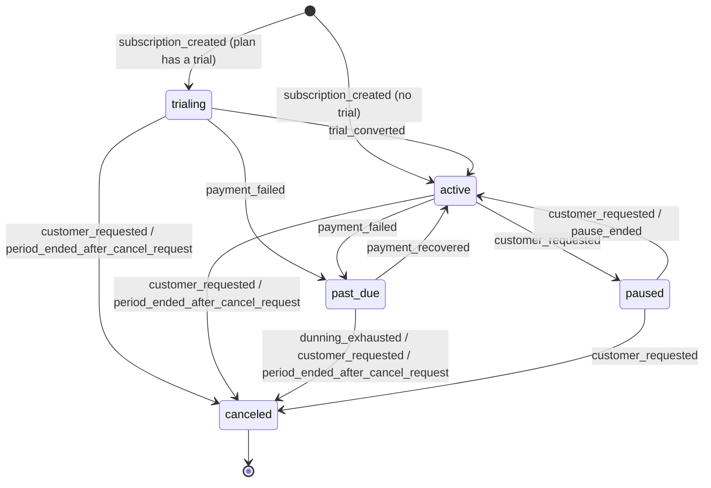
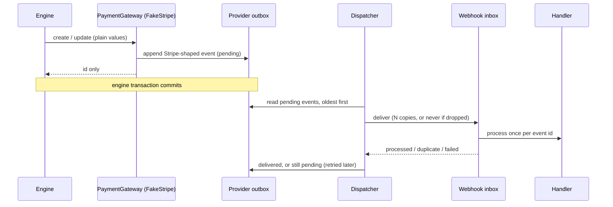

# Billing Engine

A subscription billing engine for a fictional SaaS that sells subscriptions to gyms and
fitness studios. It is a portfolio project focused on one narrow, easy-to-get-wrong problem:
**managing the financial lifecycle of a subscription correctly**.

It covers what usually goes wrong in real billing systems: a strict subscription state
machine, idempotent webhook processing, mid-cycle proration, a dunning schedule for failed
payments, reconciliation against the payment provider, and an append-only audit trail.

The payment provider (Stripe) is simulated in-process. No real network calls are made, and a
simulated clock lets you fast-forward weeks of billing in seconds.

> **Status:** in progress. The foundation is done; features ship one plan at a time (see
> [Roadmap](#roadmap)).

## Stack

| Part | Technology |
|---|---|
| API | Ruby 3.4, Rails 8.1 (API-only), SQLite, RSpec |
| Web | Vue 3 (Composition API), TypeScript, Pinia, Vue Router, Tailwind CSS v4, Vitest |
| CI | GitHub Actions (lint, security scans, tests, build) |

## Quick start

### Requirements

- Ruby 3.4.11 (see `api/.ruby-version`)
- `sqlite3` command-line tool (Rails uses it to load `db/structure.sql`)
- Node.js 22.18+ or 24.12+
- pnpm 10

### Setup and run

```sh
bin/setup   # installs gems and packages, prepares the SQLite database
bin/dev     # starts the API and the web app together
```

| App | URL |
|---|---|
| Web | http://localhost:3000 |
| API | http://localhost:3001/api/v1 |

### Environment variables

All optional; the defaults work for local development.

| Variable | App | Default | Purpose |
|---|---|---|---|
| `VITE_API_URL` | web | `http://localhost:3001/api/v1` | API base URL |
| `WEB_ORIGIN` | api | `http://localhost:3000` | Origin allowed by CORS |
| `SIMULATOR_ENABLED` | api | `true` in development/test | Mounts the simulator endpoints (clock, fake provider) |
| `PORT` | api | `3001` | API port |

### Tests

```sh
cd api && bundle exec rspec
cd web && pnpm test:unit
```

## Subscription lifecycle



The diagram mirrors `SubscriptionStateMachine::TRANSITIONS`, the single
source of truth; a spec walks every (from, to) pair of that table, so an edge can't be added
or removed without the tests noticing. Status changes go through one service,
`Subscriptions::Transition`, which checks the edge and the reason, then updates the status,
writes a `subscription_state_transitions` row and an audit event in the same transaction.
Updating `status` any other way raises.

A cancellation "at period end" is a flag, not a state: the subscription keeps its status
until the period ends, and the flag can be removed until then.

## Webhook processing

Provider events arrive at `POST /api/v1/webhooks/stripe` and go through an inbox
(`webhook_events`), one row per provider event id:

1. **Claim.** `INSERT … ON CONFLICT (provider_event_id) DO NOTHING` guarantees one row per
   event, however many deliveries race.
2. **Process.** A second transaction locks and re-reads the row. If it is already done, the
   delivery is a duplicate: it is counted and answered 200. Otherwise the handler runs and
   its changes commit together with the row's final status, so an event can't be half
   applied, or applied twice.
3. **Fail loudly.** If the handler raises, its changes roll back and a third transaction
   records the failure on the row; the endpoint answers 500, which is what makes the
   provider retry. A failed row can also be reprocessed from the inbox screen.

Every change a webhook causes is audited with actor `webhook` and a link to the inbox row,
so the audit log can always answer "which event did this?".

### The fake provider

The payment provider is a fake Stripe living in the same app (`app/models/fake_stripe/`).
The engine only reaches it through `PaymentGateway`, and it only answers the way Stripe does:
identifiers now, outcomes later as webhooks.



The Scenario Lab (`/simulator`) shows the outbox and can make the provider report a
subscription, possibly disagreeing with the engine, dropped (a lost webhook) or sent several
times (duplicates).

Try it with the fixture (an event type the engine doesn't handle yet, so it is acknowledged
and ignored):

```sh
curl -s -X POST localhost:3001/api/v1/webhooks/stripe \
  -H 'Content-Type: application/json' -d @api/spec/fixtures/webhooks/invoice_paid.json
# {"status":"ignored_unhandled",...}  — send it again:
# {"status":"duplicate",...}          — the inbox shows one row with 1 duplicate delivery
```

## Architecture decisions

- **One gateway, outcomes only via webhooks.** The engine talks to the provider through
  `PaymentGateway`; replacing the fake with real Stripe means one new module. Gateway calls
  return identifiers only, so no engine code can depend on a synchronous "it worked".
- **The fake provider is an event-sourced outbox that never reads engine data.** Its
  methods take plain values and write only to `mocked_webhook_events` (a spec checks every SQL
  statement). That independence is what makes its history a fair "expected state" for
  reconciliation later.
- **Delivery after commit.** Events are delivered once every open transaction has
  committed, so a webhook never sees, or acts on, data that may still roll back, and the
  provider never hears about a change that rolled back.
- **Subscription changes are pushed from an `after_commit` callback**, with a snapshot of
  plain values. No service can forget it, and webhook observation writes with
  `update_columns`, so provider reports are never echoed back.

- **Simulated clock.** Billing flows span weeks (trials, renewals, a 14-day dunning
  schedule), so every piece of code reads time from `BillingClock.now`, never from
  `Time.current`. A custom RuboCop cop (`Billing/DirectTimeAccess`) fails the build if real
  time is read anywhere else. Advancing the clock runs one tick per simulated day, so work due
  on day 3 happens on day 3 even when you jump a week. Time only moves forward, except for an
  explicit reset.
- **Append-only audit trail, enforced by the database.** Every state change writes a row
  to `billing_events` through a single entry point (`Audit.record`), inside the same
  transaction as the change itself, so both commit or neither does. Rows can't be changed
  afterwards: the model refuses updates and deletes, and SQLite triggers refuse them too, so
  paths that skip the model (`update_all`, `delete_all`, raw SQL) fail as well. Each event
  stores both business time (`occurred_at`, from the simulated clock) and the real time it
  was written.
- **`structure.sql` instead of `schema.rb`.** `schema.rb` can't represent triggers, so a test
  or freshly created database would silently lose the append-only guarantee. The cost is
  needing the `sqlite3` CLI.
- **Plans are immutable where it matters.** A plan's code, price, currency and interval are
  read-only once created (assigning them raises). Changing the price of a plan in use would
  silently change what current subscribers pay; repricing means creating a new plan and
  archiving the old one.
- **Credit is a ledger, the balance is a cache.** Customer credit only moves through
  `CreditLedger`, which writes an append-only entry, updates the cached balance and audits
  the movement in one transaction, with the customer row locked so two debits can't both
  pass the balance check. Each reason can only move the balance in its own direction.
- **Test cards by token, like Stripe test mode.** A payment method stores a token such as
  `pm_card_chargeDeclinedInsufficientFunds`, and that token decides how the fake provider
  answers a charge. Demo scenarios pick a card that will fail without any real card data.
- **Optimistic locking on every operator action.** Each action carries the `lock_version` the
  screen was loaded with. If the subscription changed in between (another operator, or a tick
  that renewed or canceled it), the API answers 409 and applies nothing; the UI offers to
  reload instead of acting on a state nobody saw.
- **Idempotency keys for state-changing requests.** The frontend sends one
  `Idempotency-Key` per user intent (per dialog). The API stores the first response and
  replays it for retries of the same request (errors included), refuses the key for a
  different request, and doesn't keep 5xx responses so a real retry can run.
- **Allowed actions come from the API.** `allowed_actions` is computed by the model from the
  state and flags; the API refuses anything else and the UI only renders those buttons, so
  both can't disagree.
- **Provisional until invoicing (plan 07).** Trials currently convert to active when they end
  and active periods roll forward when they end, both without charging, and plans without a
  trial start active. Plan 07 replaces this with an invoice and a payment webhook.
- **Inbox pattern for webhooks, deduplicated by event id.** The provider's event id is the
  idempotency key, backed by a unique index. Duplicates and deliberately ignored event types
  get 200 (anything else makes the provider retry forever); a failed handler gets 500 so the
  provider does retry.
- **The engine is the authority on subscription state.** `customer.subscription.*` events are
  recorded ("the provider says past_due, we say active"), not applied. Disagreements are for
  reconciliation to surface, instead of the provider silently overwriting engine decisions.
- **Ordering per object.** Each record remembers the newest provider event applied to it and
  skips older ones. The check is per record: an old event about one invoice is still valid
  after a newer event about another.
- **Money as integer cents.** Every amount is stored as `*_cents` integers with a `currency`
  column (always `USD`). Floats never touch money.
- **One error shape, one list shape.** Every API error is
  `{ "error": { "code", "message", "details" } }`, with 422 for business-rule violations, 409
  for concurrent-edit conflicts and 404 for missing records. Every list is
  `{ "data": [...], "meta": { "page", "per_page", "total_count", "total_pages" } }`.
- **No authentication.** The app models a single back-office operator. Authentication is out
  of scope for a project about billing correctness.
- **Lean Rails.** Only the frameworks in use are loaded (Active Record, Active Job, Action
  Controller). Deployment tooling was removed, since the project is meant to run locally.

## Edge cases handled

- The simulated clock can't move backwards (except through an explicit reset), and advancing
  several days runs each day's work in order.
- A tick that fails rolls back that simulated day instead of leaving time advanced with
  half-done work.
- Updating or deleting an audit row is refused by the database, even through raw SQL.
- A business change and its audit row can't be split: recording an audit event outside a
  transaction raises, and rolling back the change rolls back the event.
- Repricing a plan can't affect current subscribers: price and interval can't be changed
  after creation (model and database rules), and archived plans keep working for existing
  subscribers.
- A card that has already expired is refused on attach. A card can also expire while a
  subscription runs, because expiry is checked against the simulated clock.
- Customer credit can never go negative (service check, model validation and a database
  constraint), and a failed operation leaves the ledger and the cached balance untouched.
- At most one default card per customer, enforced by a partial unique index; switching the
  default unsets the old one first in the same transaction.
- Emails are unique regardless of case or surrounding spaces.
- An invalid status change is refused with the allowed alternatives, and nothing is written.
- Two operators acting on the same subscription: the second one gets a 409 instead of
  overwriting the first.
- Double click or retry on "Cancel": the idempotency key makes it apply once and replays the
  same response. After a 4xx the frontend starts a new key, so fixing the input and submitting
  again is a new attempt, not a "reused key" error; after a network error it keeps the key.
- Cancel at period end, including during a trial: the trial ends canceled instead of
  converting, because cancellations run before trial conversion in each tick.
- Pause with an automatic resume date; an open-ended pause stays paused until resumed.
- One live subscription per customer, enforced by a partial unique index as well as by the
  service.
- The same webhook delivered several times is applied once and counted as duplicates.
- Two deliveries of the same event racing each other: the lock and re-read inside the
  processing transaction let only one apply it.
- A webhook handler that fails leaves no partial changes, keeps its error on the inbox row,
  answers 500 so the provider retries, and succeeds on the next delivery.
- An event older than one already applied to the same record is skipped as stale; events
  sharing a timestamp are all processed.
- Unknown event types are acknowledged and ignored; an event about a subscription the engine
  doesn't know fails (and is retried) instead of being dropped; a malformed payload (bad
  JSON, missing fields, `data.object` that isn't an object) gets 400, never a 500 that the
  provider would retry forever.
- Unsigned events are only accepted while the simulator is on; with it off, the endpoint
  refuses everything until real signature verification exists (fail closed).
- A dropped (lost) webhook stays in the provider's outbox and never reaches the engine
  until it is delivered by hand; reconciliation (plan 11) will flag it on its own.
- A delivery the inbox fails (500) stays pending at the provider and is retried on the next
  flush, at the latest once per simulated day; once it succeeds, the inbox processes it once.
- A change that rolls back never reaches the provider; a request refused by local checks
  (expired card, duplicate email) never reaches it either.
- If the provider can't be told about a committed change, the change stands, the request
  still succeeds and the failure is audited (`provider.sync_failed`) for reconciliation, instead
  of a 500 for work that is already done.
- An unexpected error while delivering a webhook counts as a failed delivery (retried later),
  never as an error for the request whose commit triggered the delivery. A manually delivered
  "lost" event that fails goes back to the retry queue.
- Recording a webhook doesn't bump the subscription's `lock_version`, so an operator's open
  screen isn't invalidated by an event that changed nothing.
- Money typed by the operator is parsed digit by digit, never through floating point, and an
  ambiguous comma (`12,5`) is rejected instead of guessed.

## Roadmap

Each feature is planned in [`docs/`](docs/) before it is built. The brief and every
agreed decision live in [`docs/00-prompt.md`](docs/00-prompt.md).

| # | Feature | Status |
|---|---|---|
| 01 | [Foundation](docs/01-foundation.md) | Done |
| 02 | [Audit log](docs/02-audit-log.md) | Done |
| 03 | [Catalog and customers](docs/03-catalog-and-customers.md) | Done |
| 04 | [Subscription state machine](docs/04-subscription-state-machine.md) | Done |
| 05 | [Webhook ingestion and idempotency](docs/05-webhook-ingestion.md) | Done |
| 06 | [Fake payment provider](docs/06-fake-payment-provider.md) | Done |
| 07 | [Invoicing and payments](docs/07-invoicing-and-payments.md) | Planned |
| 08 | [Plan changes and proration](docs/08-plan-changes-and-proration.md) | Planned |
| 09 | [Refunds](docs/09-refunds.md) | Planned |
| 10 | [Dunning](docs/10-dunning.md) | Planned |
| 11 | [Reconciliation](docs/11-reconciliation.md) | Planned |
| 12 | [Scenario Lab and seeds](docs/12-scenario-lab-and-seeds.md) | Planned |
| 13 | [Dashboard](docs/13-dashboard.md) | Planned |
| 14 | [Documentation and release](docs/14-documentation-and-release.md) | Planned |

## Project structure

```
api/    Rails API: app/services (business logic), app/serializers, app/errors, spec/
web/    Vue app: src/api (HTTP client), src/features (screens per domain), src/stores
docs/   Brief, decisions and one plan per feature
bin/    setup and dev scripts for both apps
```
