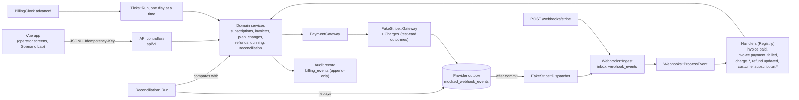
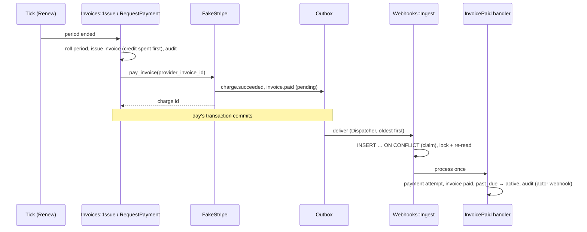
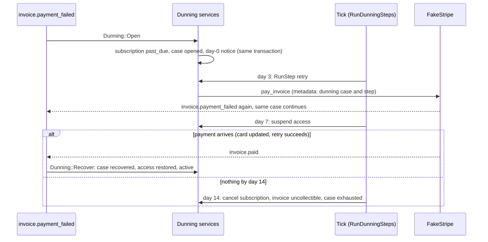
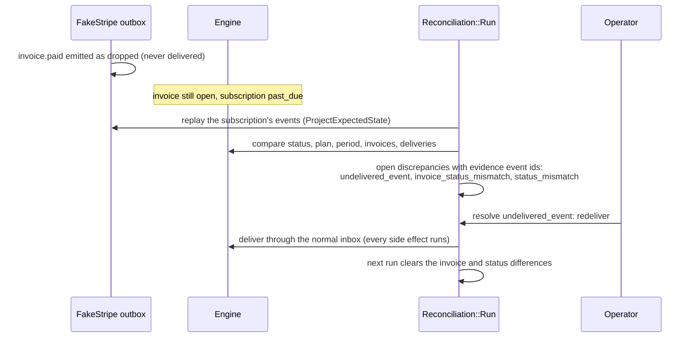
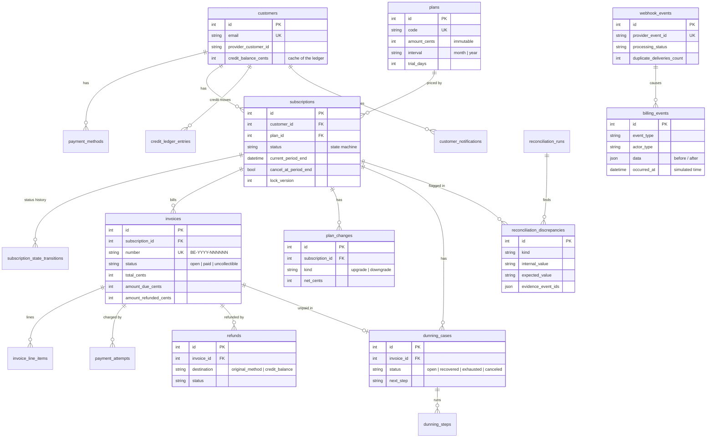

# Architecture

How the pieces of the billing engine fit together. The [README](../README.md) explains the
domain rules; this page shows the components, the three flows that matter most and the data
model. Every diagram reflects the code as it is at `v1.0.0`.

## Components

- **The engine never waits for the provider.** Gateway calls return identifiers only; every
  outcome (paid, failed, refunded) comes back as a webhook through the same inbox a real
  Stripe would use.
- **The fake provider never reads engine tables.** It keeps its own history in the outbox,
  which is why reconciliation can treat that history as an independent "expected state".
- **Time is simulated.** `BillingClock.now` is the only clock (a RuboCop cop forbids
  `Time.current`). Advancing N days runs N ticks, each in its own transaction.

### The daily tick

`Ticks::Run::STEPS`, in this order, because each step depends on the one before:

| Step | What it does |
|---|---|
| `CancelAtPeriodEnd` | cancels subscriptions whose period ended with a cancellation scheduled |
| `EndTrials` | issues the trial-end invoice and asks the provider to collect it |
| `ResumePaused` | ends timed pauses, starting a fresh period |
| `Renew` | rolls the period, applies a scheduled plan change, issues and collects the invoice |
| `RunDunningSteps` | runs every dunning step due today (notice, retry, suspend, cancel) |
| `RetryProviderDeliveries` | sends again the provider events still pending (the inbox failed them earlier) |
| `Reconcile` | full reconciliation, **after** the day's transaction has committed and its events were delivered, so in-flight changes aren't reported as differences |

## Flows

### A renewal paid by card

### Dunning, day 0 to day 14

Each step writes a `dunning_steps` row (unique per case and step), so a job running twice or
a clock jumping two weeks still runs each step exactly once.

### A lost webhook, found and fixed

A status correction (`apply_expected`) is blocked while the lost event behind it is still open,
because redelivering fixes the invoice, the dunning case and the audit trail together;
patching the status alone would fix only the symptom.

## Rules that hold everywhere

- **One transaction per business change**, and its audit row inside it (`Audit.record`
  raises without a joinable transaction).
- **Provider events are delivered after every transaction has committed** (`after_all_transactions_commit`),
  so a webhook never acts on data that might roll back, and the provider never hears about
  a change that did.
- **Optimistic locking** on subscriptions (`lock_version`): a stale screen gets 409.
- **Idempotency keys** on every state-changing request from the UI; the webhook inbox is
  idempotent by provider event id.
- **Append-only tables** are protected twice: the `AppendOnly` model concern and SQLite
  triggers (`*_no_update`, `*_no_delete`) kept in `db/structure.sql`.

## Data model

Append-only (triggers refuse `UPDATE` and `DELETE`): `billing_events`,
`subscription_state_transitions`, `credit_ledger_entries`, `invoice_line_items`,
`payment_attempts`, `dunning_steps`, `customer_notifications`. Migrations never add a
foreign key to them, or pointing at them, after they are created: SQLite adds constraints by
rebuilding the table, and the rebuild would silently drop its triggers.

Tables outside the diagram: `mocked_webhook_events` (the fake provider's outbox, deliberately
unrelated to engine tables), `idempotency_keys`, `invoice_number_sequences`,
`simulation_clock` (one row), `scenario_runs` (Scenario Lab history).
